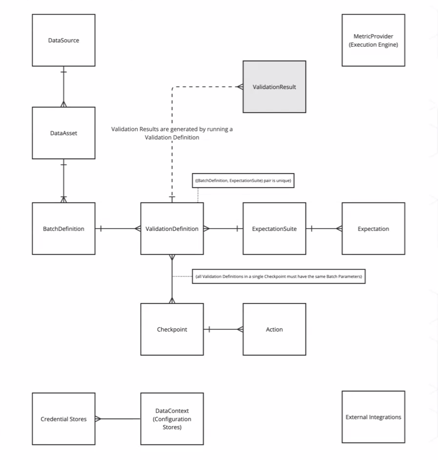

# Traspaso de proyectos y seguimiento

## Comunicación y traspaso del proyecto 

### Por qué es importante?

- Si no se haca bien, el equipo que recibe el código, podría no saber cómo continuarlo y aplicarlo
- Atrasos y falsas expectativas

### Público objetivo

- Técnico
- No técnico
- Para documentación técnica, no es muy eficiente usar presentaciones. Es mejor en documento bien detallado, fácil de leer, copiar y pegar código.
- Para una documentación de alto nivel, puede bastar una presentación, pero eso NO es suficiente

### Canvas Analytics

- Por qué es útil?
- Qué preguntas es útil responder?

### Documentación

- La documentación es parte del proyecto y está "viva"
- Documentación en código versus reportes
- No usen presentaciones para documentar. Ese no es su rol.

### Objetivo

- Hay que arreglarselas para salir del proyecto sin que algo (o alguien) se queme
- Incluir a la contraparte técnica desde el comienzo
- Les debe hacer sentido el proceso y deben están involucrados en todo
- Esto evita traspasos apresurados y caótocos a última hora

### Clean Code

- Reusable
- Composable
- Easy to understand

- Cuándo y cómo comentar?
- Nombres descriptivos de variables, funciones, objetos, etc.
- Evitar side-efects
- Usar rutas reletivas, no absolutas
- Usar archivos de configuración de IDE
- Usar ambientes virtuales con las librerías necesarias
- Jamás commitear credenciales. Usar .env

- SOLID principles

### Pull Requests

- Por qué son importantes
- Por qué les pueden servir en sus proyectos
- Por qué sirven en la vida real

### README.md

- Buena documentación de la aplicación
  - Cómo descargar
  - Cómo configurar
  - Cómo instalar
  - Cómo utilizar
  - Cómo contribuir
  - Cómo hacer cambios a producción

- Buena documentación de la arquitectura
  - Cómo cada sección se comunica con otras
  - Cuál es el ambiente de trabajo
  - Cuál es el workflow de desarrollo
  - Cómo es el CI/CD pipelines
  - Dónde se hacen tests automáticos

- No documentar necesariamente todo en un solo README gigante. Hacerlo de forma parcelada, por carpetas.

### Estructura de carpetas y archivos

- Por qué es útil?
- Ejemplo de una
- Modularización

## Operación Backup

- Qué es y por qué es útil
- Cómo hacerla
- Cómo evaluarla

## Seguimiento de métricas

### Métricas a evaluar

- Métricas de negocio
  - Dinero generado o ahorrado
  - CTR
  - LTV
  - etc
- Métricas analíticas
  - Métricas de clasificación
    - Accuracy
    - Precision
    - Recall
    - FBeta-Score
    - ROC
    - AUC
    - Lift
    - Cross-entropy
  - Métricas de regresión o series de tiempo
    - R^2
    - MAE
    - MSE
    - RMSE
    - MAPE
    - SMAPE
    - MdRAE
    - GMRAE
    - MASE
    - Cosine Similarity
  - Métricas adaptadas

### Logging

- Guardar métricas a lo largo del tiempo con nombres claros o algún hash reconocible

### Dashboard de seguimiento

- Crear dashboard de seguimiento de métricas, para monitorear si las predicciones se degradan

### Alertas

- Enviar alertas automáticas cuando ocurren ciertos eventos que hay que definir

### Data Quality

- Great Expectations
- 

## Manifiesto de programación

- Repaso de qué es y puntos más relevantes

## Algunas consideraciones y fuentes de error

- Rutas relativas versus absolutas
- Rutas relativas al archivo versus al proyecto
- Trabajo en formato de proyectos
- Ambientes virtuales
- Variables de ambiente
- Configuración de ambiente de trabajo de forma transversal

## Links relevantes

- https://www.youtube.com/watch?v=bEir1fAcDNw&ab_channel=Praxent
- https://www.youtube.com/watch?v=3si6p6KTsbI
- https://www.freecodecamp.org/news/solid-principles-for-better-software-design/
- https://www.digitalocean.com/community/conceptual-articles/s-o-l-i-d-the-first-five-principles-of-object-oriented-design
- https://medium.com/@leandroscarvalho/data-product-canvas-a-practical-framework-for-building-high-performance-data-products-7a1717f79f0
- https://www.sciencedirect.com/science/article/pii/S2212827118301549
- https://towardsdatascience.com/time-series-forecast-error-metrics-you-should-know-cc88b8c67f27
- https://machinelearningmastery.com/regression-metrics-for-machine-learning/
- https://www.youtube.com/watch?v=LbX4X71-TFI&ab_channel=AssemblyAI
- https://www.aiacceleratorinstitute.com/evaluating-machine-learning-models-metrics-and-techniques/
- https://github.com/rodo-nunez/ejemplo_de_modularizacion_de_proyecto.git
- https://github.com/rodo-nunez/MLOps_La_clave_de_la_reproducibilidad_y_buenas_practicas_para_modelos_efectivos
- https://mlflow.org/docs/latest/tracking.html
- https://docs.greatexpectations.io/docs/home/